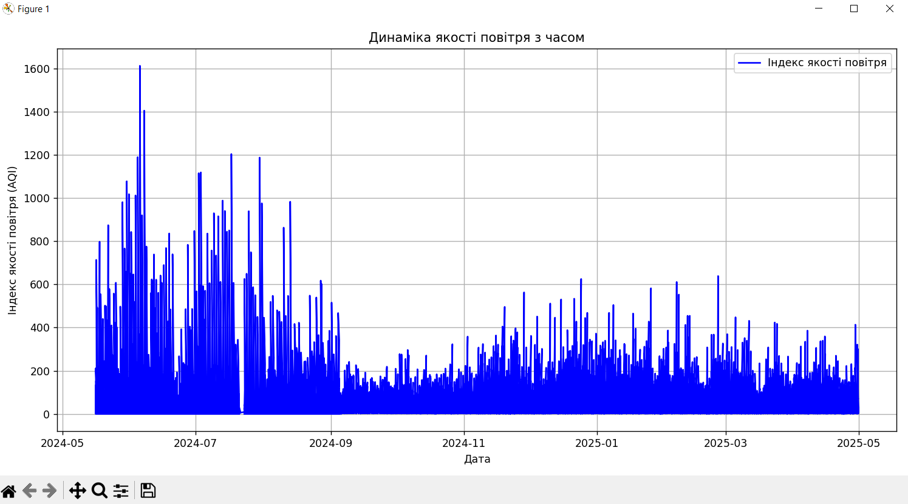
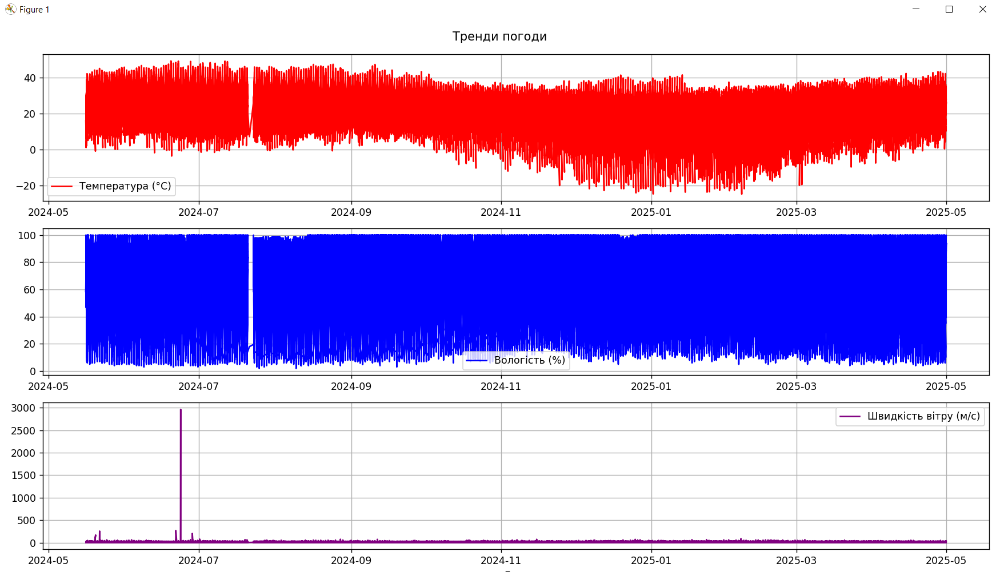
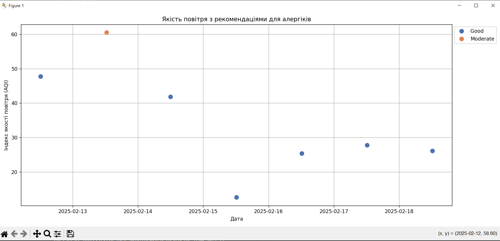
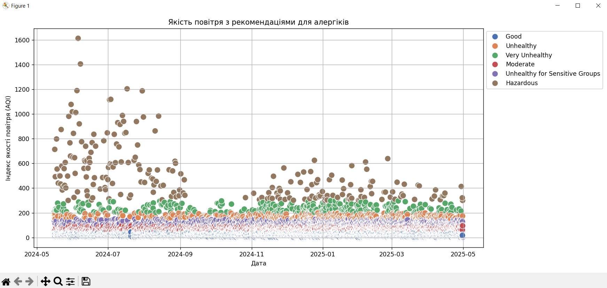

# Практична робота №3

У цьому проєкті я використав Python, адже це моя основна мова для роботи з даними. Як базу даних обрав SQLAlchemy з SQLite, щоб відпрацювати зберігання погодних даних. Для візуалізації використано Matplotlib і Seaborn, а також було реалізовано базову обробку даних через модульну структуру. Програма формує таблицю рекомендацій для алергіків на основі якості повітря, температури, вологості тощо.

# Короткий опис

## 1 - Завантаження та очищення даних

Файл з даними зберігається у data/weather_data.csv. Його завантаження і попередня очистка здійснюються за допомогою функції:
```bash
df = load_and_clean_data(filepath)
```
Це усуває пропущені значення, перетворює типи колонок (наприклад, datetime) та готує дані до подальшої обробки.

## 2 - Обробка та додавання в базу даних

Створення структури бази:
```bash
Base.metadata.create_all(bind=engine)
```

Після цього можна записати очищені дані в базу:
```bash
insert_data_to_db(df, db)
```

## 3 - DataFrame

За основу датафрейму використав ```pandas```(занесення данних у таблиці, очищення і т.д.)
```bash
df = engineer_features(df)
```

## 4 - Побудова графіків

Спочатку програма малює графіки якості повітря з часом та моду погоди:

```bash
plot_air_quality(df)
plot_weather_trends(df)
```




Після цього ми вказуємо період і місце для аналізу всередені коду:

```bash
generate_air_quality_report(str('time'), int(days), str('place'))
```

І потім будується графік індексу якості повітря разом з рекомендаціями для алергіків:



І загальний:
